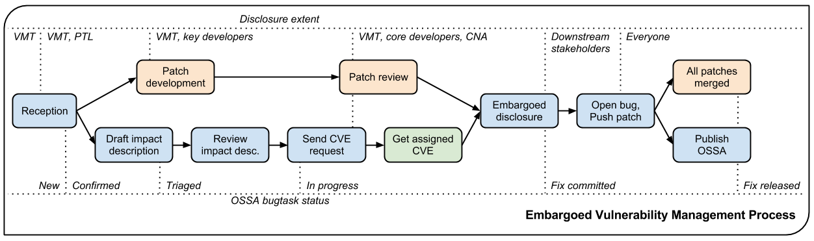

.. :Copyright: 2017, OpenStack Vulnerability Management Team
.. :License: This work is licensed under a Creative Commons
             Attribution 3.0 Unported License.
             http://creativecommons.org/licenses/by/3.0/legalcode

==================================
 Vulnerability Management Process
==================================

The OpenStack vulnerability management team (VMT_) is responsible
for coordinating the progressive disclosure of a vulnerability.

Members of the team are independent and security-minded folks who
ensure that vulnerabilities are dealt with in a timely manner and
that downstream stakeholders are notified in a coordinated and fair
manner. Where a member of the team is employed by a downstream
stakeholder, the member does not give their employer prior notice of
any vulnerabilities. In order to reduce the disclosure of
vulnerability in the early stages, membership of this team is
intentionally limited to a small number of people.

.. _VMT: https://launchpad.net/~openstack-vuln-mgmt

Supported versions
------------------

The Vulnerability Management team coordinates patches fixing
vulnerabilities in supported stable branches (corresponding to
previous major releases) of OpenStack, in addition to the master
branch (next version under development), for all `security supported
projects`_.

.. _security supported projects: http://governance.openstack.org/reference/tags/vulnerability_managed.html

Process
-------

Each security bug is assigned a VMT *coordinator* (member from the
vulnerability management team) that will drive the fixing and
disclosure process. Here are the steps we follow.

Reception
^^^^^^^^^

A report can be received either as a private encrypted email to one
of the VMT members, or as a StoryBoard or Launchpad security bug
(check the box marked "this is a security issue").

The first steps performed by the VMT are to:

* create a bug in StoryBoard or Launchpad if one does not yet exist
* check that the report indicates the correct project and adjust as
  necessary
* prefix the report description with an `embargo reminder`_
  including an end date for its embargo
* add a *Todo/Incomplete* task for the openstack/ossa or ossa
  project
* subscribe the project's core security review team for confirmation
  of impact and determination of affected branches
* add a comment with an `incomplete reception`_ message

Once the VMT confirms an OSSA is warranted, the ossa bugtask status
will be set to *Progress/Confirmed*. If the need for an OSSA is
challenged, the ossa bugtask status should be set back to
*Todo/Incomplete* until that question is resolved.

If no OSSA is warranted and there is no benefit to an OSSN_ then the
ossa bugtask will be set to *Won't Fix* or *Invalid* (depending on
the tracker and situation) and the bug state switched from *Private
Security* to *Public*, optionally adding a *security* bug tag if the
report concerns a potential security hardening opportunity. The
specifics are indexed in the `report taxonomy`_ and `task status`_
tables.

.. _embargo reminder: #reception-embargo-reminder-private-issues
.. _incomplete reception: #reception-incomplete-message-unconfirmed-issues
.. _OSSN: https://wiki.openstack.org/wiki/Security_Notes
.. _report taxonomy: #incident-report-taxonomy
.. _task status: #ossa-task-status

Patch development
^^^^^^^^^^^^^^^^^

For a private report, the reporter (automatic if reported directly
as a bug) and the affected projects' core security review teams plus
anyone they deem necessary to develop and validate a fix are added
to the bug's subscription list. A fix is proposed as a patch to the
current master branch (as well as any affected supported branches)
and attached to the private bug report, **not sent to the public
code review system**.

For public reports, there is no need to directly subscribe anyone
and patches can be submitted directly to the code review system
instead of as bug attachments (though the bug should be referenced
in any commit messages so it will be updated automatically).

If project-side delays are encountered at this or any subsequent
stage of the process, the VMT and other interested parties may reach
out to that project's `Vulnerability Management Liaison`_ requesting
more immediate attention to the issue.

.. _Vulnerability Management Liaison: https://wiki.openstack.org/wiki/CrossProjectLiaisons#Vulnerability_management

Patch review
^^^^^^^^^^^^

For a private report once the initial patch has been attached to the
bug, core reviewers on the subscription list from the project in
question should review it and suggest updates or pre-approve it for
merging. Privately-developed patches need to be pre-approved so that
they can be fast-tracked through public code review later at
disclosure time.

For public reports, OpenStack's usual public code review and
approval processes apply.

Draft impact description
^^^^^^^^^^^^^^^^^^^^^^^^

In the mean time, the VMT coordinator prepares a vulnerability
description that will be communicated to downstream stakeholders,
and will serve as the basis for the Security Advisory that will be
finally published.

The description should properly credit the reporter, specify
affected versions (including unsupported ones) and accurately
describe impact and mitigation mechanisms. The VMT coordinator
should use the template below. Once the description is posted, the
openstack/ossa or ossa bugtask status should be switched to
*Review/Triaged*.

Review impact description
^^^^^^^^^^^^^^^^^^^^^^^^^

The description is validated by the reporter and the PTL.

Send CVE request
^^^^^^^^^^^^^^^^

To ensure full traceability, we attempt to obtain a CVE assignment
before the issue is communicated to a larger public. This is
generally done as the patch gets nearer to final approval. The ossa
bugtask status is set to *In progress* and the approved impact
description is submitted through `MITRE's CVE Request form`_. The
*request type* is ``Request a CVE ID``, the *e-mail address* should
be that of the requester (generally the assigned VMT coordinator in
the case of reports officially managed by the VMT), and for
embargoed reports the coordinator's OpenPGP key should be pasted
into the field provided.

In the *required* section set the checkboxes indicating the product
is not CNA-covered and that no prior CVE ID has been assigned,
select an appropriate *vulnerability  type* (using ``Other or
Unknown`` to enter a freeform type if there is nothing relevant on
the drop-down), set the *vendor* to ``OpenStack``, and the *product*
and *version* fields to match the ``$PROJECTS`` and
``$AFFECTED_VERSIONS`` from the impact description. In the
*optional* section set the radio button for *confirmed/acknowledged*
to ``Yes``, choose an appropriate *attack type* in the drop-down
(often this is ``Context-dependent`` for our cases), check the
relevant *impact* checkboxes, attempt to fill in the *affected
components* and *attack vector* fields if possible, paste in the
*suggested description* from the prose of the impact description
(usually omitting the first sentence as it's redundant with other
fields), put the ``$CREDIT`` details in the *discoverer/credits*
field, and the bug URL (along with Gerrit URLs for patches if
already public) in the *references* field. If the report is still
private, note that in the *additional information* field like ``This
report is currently under embargo and no disclosure date has been
scheduled at this time.``

At the bottom of the page, fill in the *security code* and click the
*submit request* button. If some fields contain invalid data they
will be highlighted red; correct these, update the *security code*
and *submit request* again until you get a confirmation page.

.. _MITRE's CVE Request form: https://cveform.mitre.org/

Get assigned CVE
^^^^^^^^^^^^^^^^

MITRE returns the assigned CVE. It is added to the bug (see "link to
CVE" at the top-right in Launchpad or use a story comment in
StoryBoard), and the bug is retitled to "$TITLE ($CVE)".

Embargoed disclosure
^^^^^^^^^^^^^^^^^^^^

Once the patches are approved and the CVE is assigned, a signed
email with the vulnerability description is sent to the downstream
stakeholders. The disclosure date is set to 3-5 business days,
excluding Monday/Friday and holiday periods, at 1500 UTC. No
stakeholder is supposed to deploy public patches before disclosure
date. Once the email is sent, any stakeholders who reply requesting
subscription to the report may be added.

For non-embargoed, public vulnerabilities no separate downstream
advance notification is sent. Instead the OSSA bugtask is set to fix
committed status once the CVE assignment is received OSSA is
drafting begins immediately.

Open bug, Push patch
^^^^^^^^^^^^^^^^^^^^

In preparation for this, make sure you have a core reviewer and a
stable maintainer available to help pushing the fix at disclosure
time.

On the disclosure hour, open bug, push patches to Gerrit for review
on master and supported stable branches, fast-track approvals
(referencing the bug).

Update the bug title to "[OSSA-$NUM] $TITLE".

Embargo reminder can be removed at that point.

`MITRE's CVE Request form`_ should be used again at this point, but
instead select a *request type* of ``Notify CVE about a
publication`` and fill in the coordinator's *e-mail address*,
provide a *link to the advisory* (the URL to it on
https://security.openstack.org/ if this was an official OSSA), the
*CVE IDs* covered, and the *date published*. Once more, fill in the
*security code* at the bottom of the page and *submit request*.

Publish OSSA
^^^^^^^^^^^^

Shortly after pushing the patches (potentially waiting for the first
test runs to complete), publish the advisory to the OpenStack ML.
Wait until all patches merged to supported branches before setting
the ossa bugtask status to *Fix released*.

All patches merged
^^^^^^^^^^^^^^^^^^

Patches approved in code review do not necessarily merge
immediately, but should be tracked closely until they do (if the bug
number is correctly identified in commit messages then it will be
automatically updated to reflect this as well). Subsequent security
point releases of affected software may then be tagged if warranted.

Abnormal embargo termination
^^^^^^^^^^^^^^^^^^^^^^^^^^^^

If a report is held in embargo for 90 days without a fix, or
significant details of the report are disclosed in a public venue,
the embargo is terminated by a VMT coordinator at that time and
subsequent process switches to the public report workflow instead.

Incident Report Taxonomy
------------------------

The VMT is now using this classification list in order to assist
vulnerability report triage, especially whenever a bug does not
warrant an advisory.

+----------+-----------+-------------------------------------------+
| Classes  | Outcome   | Description                               |
+==========+===========+===========================================+
| Class A  | OSSA      | A vulnerability to be fixed in master and |
|          |           | all supported releases                    |
+----------+-----------+-------------------------------------------+
| Class B1 | OSSN      | A vulnerability that can only be fixed in |
|          |           | master, security note for stable          |
|          |           | branches, e.g., default config value is   |
|          |           | insecure                                  |
+----------+-----------+-------------------------------------------+
| Class B2 | OSSN      | A vulnerability without a complete fix    |
|          |           | yet, security note for all versions,      |
|          |           | e.g., poor architecture / design          |
+----------+-----------+-------------------------------------------+
| Class B3 | OSSN      | A vulnerability in experimental or        |
|          |           | debugging features not intended for       |
|          |           | production use                            |
+----------+-----------+-------------------------------------------+
| Class C1 | Potential | Not considered a practical vulnerability  |
|          | OSSN      | (but some people might assign a CVE for   |
|          |           | it)                                       |
+----------+-----------+-------------------------------------------+
| Class C2 | Potential | A vulnerability, but not in OpenStack     |
|          | OSSN      | supported code, e.g., in a dependency     |
+----------+-----------+-------------------------------------------+
| Class D  | Potential | Not a vulnerability, just a bug with      |
|          | OSSN      | (some) security implications, e.g.,       |
|          |           | strengthening opportunities / misleading  |
|          |           | documentation                             |
+----------+-----------+-------------------------------------------+
| Class E  |           | Neither a vulnerability nor hardening     |
|          |           | opportunity                               |
+----------+-----------+-------------------------------------------+
| Class Y  |           | Vulnerability only found in development   |
|          |           | release                                   |
+----------+-----------+-------------------------------------------+
| Class Z  |           | When due process fails                    |
+----------+-----------+-------------------------------------------+

OSSA Task status
----------------

Here is a summary of the different OSSA task status meanings:

+---------------------+--------------------------------------------+
| Status              | Meaning                                    |
+=====================+============================================+
| Todo/Incomplete     | It is still unclear whenever the report    |
|                     | warrants an advisory                       |
+---------------------+--------------------------------------------+
| Progress/Confirmed  | The vulnerability is confirmed, impact     |
|                     | description is in progress                 |
+---------------------+--------------------------------------------+
| Review/Triaged      | Impact description has been submitted for  |
|                     | review                                     |
+---------------------+--------------------------------------------+
| Merged/Fix Released | All patches have been merged               |
+---------------------+--------------------------------------------+
| Invalid/Won't Fix   | No further action to be taken              |
+---------------------+--------------------------------------------+

Extent of Disclosure
--------------------

The science of vulnerability management is somewhere around being
able to assess impact and severity of a report, being able to design
security patches, being an obsessive process-following perfectionist
and respecting the rule of lesser disclosure.

Lesser disclosure is about disclosing the vulnerability details to
an increasing number of people over time, but only to the people
that are necessary to reach the next step. The diagram above shows
"disclosure extent" across the various steps of the process.

Vulnerability reporters retain final control over the disclosure of
their findings. If for some reason they are uncomfortable with our
process, their choice of disclosure terms prevails.

Embargo exceptions
^^^^^^^^^^^^^^^^^^

To keep the embargo period short and effective, the VMT may
choose to open bug reports. Issues that take too much time
to be fixed (e.g., more than 2 weeks) or issues that require
a complex patch are usually better solved in the open. Only under
unusual circumstances should any embargo extend past 90 days.

Downstream stakeholders
^^^^^^^^^^^^^^^^^^^^^^^

OpenStack as an upstream project is used in a number of
distributions, products, private and public service offerings that
are negatively affected by vulnerabilities. In the spirit of
responsible disclosure, this ecosystem, collectively known as the
downstream stakeholders, needs to be warned in advance to be able to
prepare patches and roll them out in a coordinated fashion on
disclosure day. The embargo period is kept voluntarily small (3-5
business days), as a middle ground between keeping the vulnerability
under cover for too long and not giving a chance to downstream
stakeholders to react.

If you're currently not a referenced stakeholder and think you
should definitely be included on that email distribution list,
please submit an email with a rationale to member(s) of the VMT_.

Templates
---------

Reception incomplete message (unconfirmed issues)
^^^^^^^^^^^^^^^^^^^^^^^^^^^^^^^^^^^^^^^^^^^^^^^^^

::

  Since this report concerns a possible security risk, an incomplete
  security advisory task has been added while the core security
  reviewers for the affected project or projects confirm the bug and
  discuss the scope of any vulnerability along with potential
  solutions.

Reception embargo reminder (private issues)
^^^^^^^^^^^^^^^^^^^^^^^^^^^^^^^^^^^^^^^^^^^

::

  This issue is being treated as a potential security risk under
  embargo. Please do not make any public mention of embargoed
  (private) security vulnerabilities before their coordinated
  publication by the OpenStack Vulnerability Management Team in the
  form of an official OpenStack Security Advisory. This includes
  discussion of the bug or associated fixes in public forums such as
  mailing lists, code review systems and bug trackers. Please also
  avoid private disclosure to other individuals not already approved
  for access to this information, and provide this same reminder to
  those who are made aware of the issue prior to publication. All
  discussion should remain confined to this private bug report, and
  any proposed fixes should be added to the bug as attachments. This
  embargo shall not extend past $NINETY_DAYS and will be made
  public by or on that date even if no fix is identified.

The NINETY_DAYS value should be 90 days from the date the report is
accepted by the coordinator and project reviewers are subscribed. It
can be trivially calculated with the ``date -I -d90days`` shell
command.

Impact description ($DESCRIPTION)
^^^^^^^^^^^^^^^^^^^^^^^^^^^^^^^^^

::

    Title: $TITLE
    Reporter: $CREDIT
    Products: $PROJECT
    Affects: $AFFECTED_VERSIONS

    Description:
    $CREDIT reported a vulnerability in [project feature name].
    By doing [action] a [actor] may [impact] resulting in [consequence].
    Only [project deployment mode] are affected.

The AFFECTED_VERSIONS needs to stay valid after the fix is released.
For example, when kilo, liberty and mitaka are still security supported,
the AFFECTED_VERSIONS of keystone should read like this:

::

    Affects: >=2015.1.0 <=2015.1.4, >=8.0.0 <=8.1.0 and ==9.0.0

Once kilo reaches end of life, that line becomes:

::

    Affects: >=8.0.0 <=8.1.0 and ==9.0.0

If the oldest version affected is not easily identified, leave it
open-ended:

::

    Affects: <=8.1.0 and ==9.0.0

Downstream stakeholders notification email (private issues)
^^^^^^^^^^^^^^^^^^^^^^^^^^^^^^^^^^^^^^^^^^^^^^^^^^^^^^^^^^^

We send two separate emails, to avoid off-topic replies to linux-distros:

* *To:* embargo-notice@lists.openstack.org
* *To:* linux-distros@vs.openwall.org

Subject and content for both emails is identical:

* *Subject:* [pre-OSSA] Vulnerability in OpenStack $PROJECT ($CVE)

::

    This is an advance warning of a vulnerability discovered in
    OpenStack, to give you, as downstream stakeholders, a chance to
    coordinate the release of fixes and reduce the vulnerability window.
    Please treat the following information as confidential until the
    proposed public disclosure date.

    $DESCRIPTION

    Proposed patch:
    See attached patches. Unless a flaw is discovered in them, these
    patches will be merged to their corresponding branches on the public
    disclosure date.

    CVE: $CVE

    Proposed public disclosure date/time:
    $DISCLOSURE, 1500UTC
    Please do not make the issue public (or release public patches)
    before this coordinated embargo date.

    Original private report:
    https://launchpad.net/bugs/$BUG
    For access to read and comment on this report, please reply to me
    with your Launchpad username and I will subscribe you.
    -- 
    $VMT_COORDINATOR_NAME
    OpenStack Vulnerability Management Team

Proposed patches are attached, email must be GPG-signed. Use
something unique and descriptive for the patch attachment file
names, for example ``cve-2013-4183-master-havana.patch`` or
``cve-2013-4183-stable-grizzly.patch``.

OpenStack security advisories (OSSA)
^^^^^^^^^^^^^^^^^^^^^^^^^^^^^^^^^^^^

The document is first submitted as a yaml description to the ossa
project using this template::

    date: YYYY-MM-DD

    id: OSSA-$NUM

    title: '$TITLE'

    description: '$DESCRIPTION_CONTENT'

    affected-products:
      - product: $PROJECT
        version: $AFFECTED_VERSIONS

    vulnerabilities:
      - cve-id: $CVE

    reporters:
      - name: '$CREDIT'
        affiliation: $CREDIT_AFFILIATION
        reported:
          - $CVE

    issues:
      links:
        - https://launchpad.net/bugs/$BUG

    reviews:
      kilo:
        - https://review.opendev.org/$MASTER_REVIEW

      juno:
        - https://review.opendev.org/$STABLE_REVIEW

    notes:
      - 'Optional note such as cross project version requirements'

Once approved, view the gate-ossa-docs output and browse to the
rendered HTML advisory, then alter the URL to insert ``_sources/``
before the first path component and change the file extension to
``rst`` to get the generated RST document. We send two separate
emails, to avoid off-topic replies to oss-security list:

* *To:* openstack-announce@lists.openstack.org, openstack-discuss@lists.openstack.org
* *To:* oss-security@lists.openwall.com

Subject and content for both emails is identical:

* *Subject:* [OSSA-$NUM] $PROJECT: $TITLE ($CVE)
* *Body:* The generated RST document

Notes:

* Email must be GPG-signed.
* $CVE must always be of the form CVE-YYYY-XXXX
* $NUM is of the form YYYY-XX
